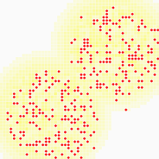

sugarscape
==========

My implementation in Python of Epstein and Axtell's large scale agent-based computational model, the Sugarscape, to explore the role of social phenomenon such as seasonal migrations, pollution, sexual reproduction, combat, and transmission of disease and even culture. 

### Results

###### Evolution from random distribution (G1, M)

### Instructions
Install Python 2.6 and above: https://www.python.org.  
Install Pygame 1.9 package: http://www.pygame.org.  
On command schell, execute: `python sugarscape.py`.  

### References
- Schelling, Thomas C. (1978). Micromotives and Macrobehavior, Norton.
- Epstein, Joshua M.; Axtell, Robert L. (1996). Growing Artificial Societies: Social Science From the Bottom Up, MIT/Brookings Institution.
