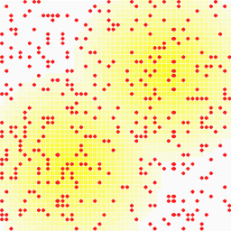
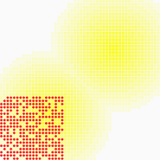
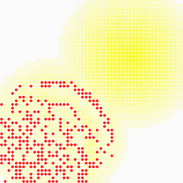
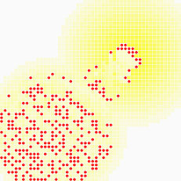
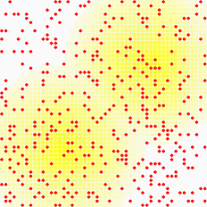
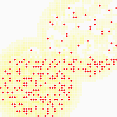
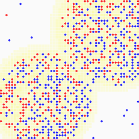
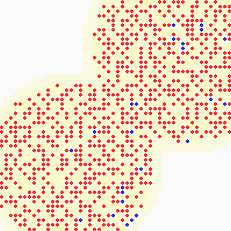

sugarscape
==========

My implementation in Python of Epstein and Axtell's large scale agent-based computational model, the Sugarscape, to explore the role of social phenomenon such as seasonal migrations, pollution, sexual reproduction, combat, and transmission of disease and even culture. 
In a formula: Cellular Automata + Agents = Sugarscape.

### Results

###### Evolution from random distribution under rules ({G1}, {M}):
 

###### Emergent diagonal waves of migration under rules ({G1}, {M}):
  

###### Seasonal migration and Hibernation resulting from rules ({S1,8,50}, {M}) and random distribution of agents:
  

###### Societal evolution through crossover of Genetic Attributes in Sexual Reproduction under rule ({G1}, {M, S}) coloring by agent vision:
  

### Instructions
Install Python 2.6 and above: https://www.python.org.  
Install Pygame 1.9 package: http://www.pygame.org.  
On command schell, execute: `python sugarscape.py`.  

### References
- Schelling, Thomas C. (1978). Micromotives and Macrobehavior, Norton.
- Epstein, Joshua M.; Axtell, Robert L. (1996). Growing Artificial Societies: Social Science From the Bottom Up, MIT/Brookings Institution.
